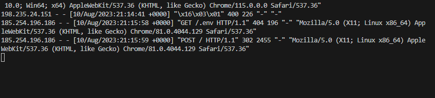

# LOAD BALANCER SOLUTION WITH APACHE

## STEP

1. Create an ubuntu server 20.04 and open TCP port 80
2. Install Apache Load Balancer on the created server with the commands below:

        #Install apache2
        sudo apt update
        sudo apt install apache2 -y
        sudo apt-get install libxml2-dev

        #Enable following modules:
        sudo a2enmod rewrite
        sudo a2enmod proxy
        sudo a2enmod proxy_balancer
        sudo a2enmod proxy_http
        sudo a2enmod headers
        sudo a2enmod lbmethod_bytraffic

        #Restart apache2 service
        sudo systemctl restart apache2
        sudo systemctl restart apache2
3. Configure load balancing with the following code by editing `/etc/apache2/sites-available/000-default.conf` file and add the code below to the file.

       <VirtualHost *:80>  </VirtualHost>

         <Proxy "balancer://mycluster">
               BalancerMember http://<WebServer1-Private-IP-Address>:80 loadfactor=5 timeout=1
               BalancerMember http://<WebServer2-Private-IP-Address>:80 loadfactor=5 timeout=1
               ProxySet lbmethod=bytraffic
               # ProxySet lbmethod=byrequests
        </Proxy>

        ProxyPreserveHost On
        ProxyPass / balancer://mycluster/
        ProxyPassReverse / balancer://mycluster/
    
4. Restart the apache with server with the command below.

        sudo systemctl restart apache2
5. Verify that the configuration works by accessing the load balancer's public IP on the browser.
     
6. Ensure that the two load balanced webservers have their own log directory by unmounting the `/var/log/httpd` from the NFS server's `/mnt/logs` directory with the command below.

       sudo umount /var/log/httpd /mnt/log
7. Run the command below to confirm with the logs the connectivity between the load balancer and the webservers.

        sudo tail -f /var/log/httpd/access_log
     
